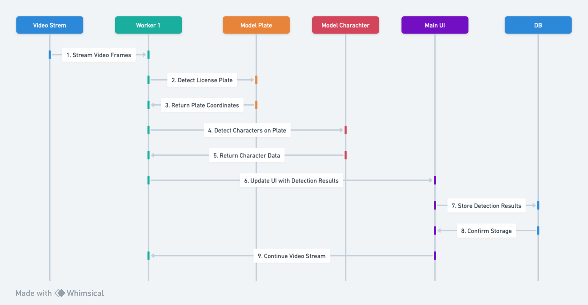
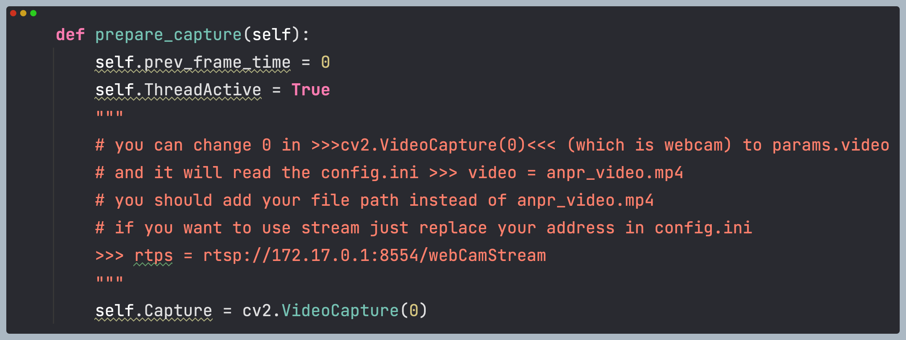

# 🚗 Persian License Plate Recognition System (PLPR)

The Persian License Plate Recognition (PLPR) system is a state-of-the-art solution designed for detecting and recognizing Persian license plates in images and video streams. Leveraging advanced deep learning models and a user-friendly interface, it ensures reliable performance across different scenarios.

## 🔍 Overview

This system aims to tackle the unique challenges associated with Persian license plate detection and recognition, offering high accuracy and efficiency. It's well-suited for applications in traffic monitoring, automated vehicle identification, and similar fields.

## ✨ Key Features

- **Advanced Detection**: Utilizes YOLOv5 models for high-accuracy license plate detection.
- **Persian Character Recognition**: Custom-trained models ensure precise recognition of Persian characters.
- **Real-Time Processing**: Capable of processing live video feeds in real-time.
- **User-Friendly GUI**: Intuitive graphical user interface simplifies interactions with the system.
---
<table>
<tr>
<td valign="top" width="50%">


   


</td>
<td valign="top" width="50%">

   ## Main GUI Explanation

- **1 Input View**: Shows video or camera feed.
- **2 Detected Plate Highlight**: Draws rectangle around detected plates.
- **3 Plate Image Display**: Shows captured image of the detected plate.
- **4 Extracted Text**: Displays text recognized from the plate image.
- **5 Owner Name**: Lists the registered owner's name.
- **6 Plate Status**: Indicates if the plate is allowed, not allowed, or non-registered.
- **7 Recent Entries Table**: Shows last 10 entries with options to add non-registered plates or view owner info.


</td>
</tr>
</table>


<table>
<tr>
<td valign="top" width="50%">

   ## Resident Management

   

Focuses on maintaining and updating resident vehicle information, managing permissions for entry, and tracking resident vehicle movements within the premises.

</td>
<td valign="top" width="50%">

   ## Entrance Management

   

Handles the regulation of vehicles entering and exiting the premises, ensuring only authorized vehicles gain access, and maintaining a log of all vehicle movements for security and administrative purposes.

</td>
</tr>
</table>


---
<table>
<tr>
<td valign="top" width="50%">



</td>
<td valign="top" width="50%">

   ## Main Flowchart Explanation

- **Start**: System initialization.
- **Input Feed**: Receives image/video stream.
- **Detect Plate**: YOLOv5 identifies license plates.
- **Character Recognition**: Custom model recognizes Persian characters.
- **Database Check**: Compares plate with database for status and owner.
- **Display Results**: Shows detection and recognition results in GUI.
- **Log Entry**: Updates recent entries table and database.
- **End/Repeat**: Continues with new input or concludes operation.

</td>
</tr>
<tr>
<td colspan="2" valign="top">

**[Read the detailed flow in wiki](https://github.com/mtkarimi/smart-resident-guard/wiki/Main-Flow)**

</td>
</tr>
</table>

### 💻 System Hardware Requirements

To ensure optimal performance of the Persian License Plate Recognition System (PLPR), the following hardware specifications are recommended:

- **Processor**: Intel Core i5 (8th Gen) or equivalent/higher.
- **Memory**: 8 GB RAM or more.
- **Graphics**: Dedicated GPU (NVIDIA GTX 1060 or equivalent) with at least 4 GB VRAM for efficient real-time processing and deep learning model computations.
- **Storage**: SSD with at least 20 GB of free space for software, models, and datasets.
- **Operating System**: Compatible with Windows 10/11, Linux (Ubuntu 18.04 or later), and macOS (10.14 Mojave or later).

These specifications are designed to handle the computational demands of advanced deep learning models, real-time video processing, and high-volume data management integral to the PLPR system. Adjustments may be necessary based on specific deployment scenarios and performance expectations.

## 🚀 Getting Started

### 🔧 Installation

1. Clone the repository and navigate to its directory:
   ```bash
   git clone https://github.com/mtkarimi/smart-resident-guard.git
   cd smart-resident-guard
   ```
2. Install the required Python packages:
   ```bash
   pip install -r requirements.txt
   ```


### 🔄 Video Source Configuration




To customize the video source for processing, modify the parameter in `cv2.VideoCapture(0)`, where `0` denotes the default webcam input. For using a specific video file, change this parameter to `params.video`, which fetches the video path from `config.ini`. In `config.ini`, set the `video` parameter to your video file path, e.g., `video = anpr_video.mp4`, replacing `anpr_video.mp4` with the path to your video file.

For streaming video sources, update the `config.ini` file with the stream address. Replace the existing video path with your stream address, for example, `rtps = rtsp://172.17.0.1:8554/webCamStream`. This adjustment allows the system to process video streams in real-time.

This flexibility in video source selection enables seamless integration and testing across various input methods, ensuring adaptability to different operational requirements.

### ▶️ Running the Application

Launch the application with the following command:
```bash
python home-yolo.py
```

## 🛠️ Usage

The system's GUI enables users to upload and process images or video streams, displaying detected license plates and recognized text. It also allows for parameter adjustments to optimize performance.

## 📖 Learn More in the Wiki

For a deep dive into the PLPR system's architecture, model training, and advanced usage, check out our [Wiki](https://github.com/mtkarimi/smart-resident-guard/wiki). It's a comprehensive resource for users and developers alike.

## 📚 Additional Academic Resources

Explore the `pdf-research` directory for research papers and articles on LPR technologies, offering insights into the techniques and algorithms behind the system.

## 💙 Special Thanks

Heartfelt thanks to the open-source projects and communities that have made this project possible. Special mentions include:

- **YOLOv5** and **PyTorch** for the core detection and recognition models.
- **PySide6** and **OpenCV** for the application interface and image processing capabilities.
- **Pillow** for enhanced image manipulation.

## 📦 Repositories Used

- YOLOv5: [GitHub](https://github.com/ultralytics/yolov5)
- PyTorch: [GitHub](https://github.com/pytorch/pytorch)
- PySide6: [GitHub](https://github.com/PySide/PySide6)
- OpenCV: [GitHub](https://github.com/opencv/opencv)
- Pillow: [GitHub](https://github.com/python-pillow/Pillow)

## 🙏 Acknowledgments

This project stands on the shoulders of giants within the AI and open-source communities. Their dedication to sharing knowledge and tools has been invaluable.

## 📄 License

GPL-3.0. See the [LICENSE](LICENSE) file for details. It means you can:
- Share Source Code: If you distribute binaries or modified versions, you must make the source code available under GPL-3.
- License: Must keep and apply GPL-3 to the modified work.
- State Modifications: If modified, must disclose that it was changed.
  
---

### 📝 Clarification on Contributions and Usage

The Persian License Plate Recognition (PLPR) system is a testament to the collaborative spirit of the open-source community. While the assembly and development of this system were carried out independently, the project is enriched through the insights and resources offered by various exceptional contributors and datasets within the community. This section is dedicated to acknowledging those invaluable learnings and resources.

🫂 **Learning from Community Leaders**: 
- Immense gratitude is directed towards [Mahdi Rahmani](https://github.com/MahdiRahmani) and [Meftun AKARSU](https://github.com/mftnakrsu). Although not directly involved in this project, their repositories served as significant learning resources. The knowledge gleaned from their work helped in navigating the complexities of license plate recognition and contributed to the foundation upon which PLPR was built.

🧱 **Acknowledging Vital Datasets**:
- The datasets that played a pivotal role in the development of the PLPR system deserve special mention. I am deeply thankful for access to:
  - [IR-LPR](https://github.com/mut-deep/IR-LPR)
  - [Iranis-dataset](https://github.com/alitourani/Iranis-dataset)
  - [ILPR](https://github.com/amirmgh1375/iranian-license-plate-recognition)
  
  These resources were crucial for training and refining the recognition capabilities of the system. My heartfelt thanks go out to the creators and contributors of these datasets for their openness and dedication to advancing the field.

**Open for Dialogue**:
- Acting in the spirit of the open-source community means valuing transparency and open communication. Should there be any questions about how I utilized these contributions, or if there are specific concerns to be addressed, I am more than willing to engage in discussions. This project is a reflection of what can be accomplished through shared knowledge and cooperation, and I am committed to learning from and contributing back to the community.

I extend my sincerest appreciation to everyone whose work has indirectly contributed to the Persian License Plate Recognition system. Your tireless efforts and willingness to share knowledge have not only made this project possible but also continue to inspire and propel the open-source movement forward.

---
🌟 **A Heartfelt Note**:

- 🍁 **Continuing Forward**: This repository has reached a milestone and I've decided to not update it going forward. It stands as a testament to what we've achieved together.
- 📚 **Inspiration and Acknowledgment**: Much of what you've read and discovered here, including the detailed Wiki, was crafted with the assistance of ChatGPT. This AI has been an invaluable tool in articulating ideas and descriptions.
- 🌈 **Gratitude and Learning**: I encourage you to explore the works of the contributors and datasets mentioned here. Their efforts not only enriched this project but also provide vast oceans of knowledge and inspiration for us all.
- 🧩 **The Journey**: If there's one thing I've learned, it's that creativity is about connecting ideas. My role was more of an assembler, piecing together the incredible innovations and knowledge shared by the community to create something meaningful.

💖 **Thank you all for your support, curiosity, and for joining me on this journey. Here's to the endless potential of collaboration and open source! 🥂**


